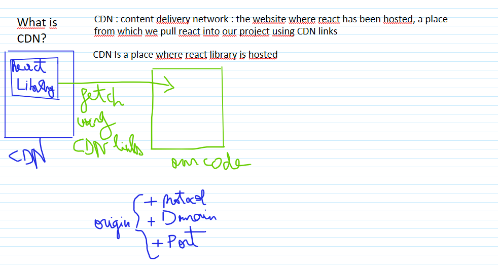
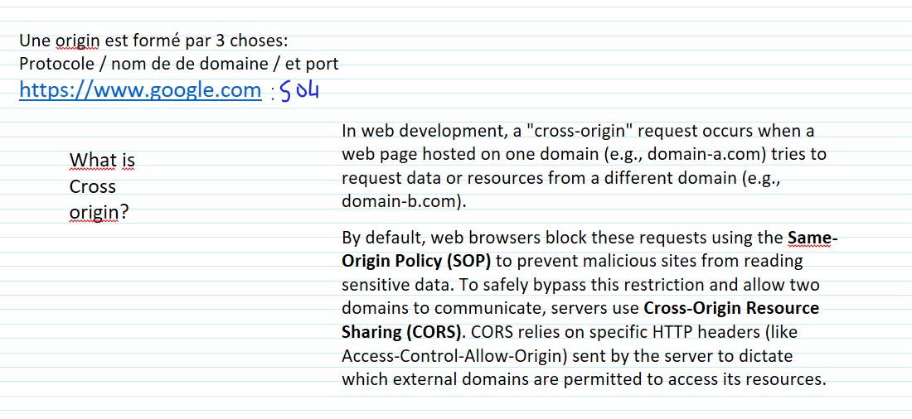
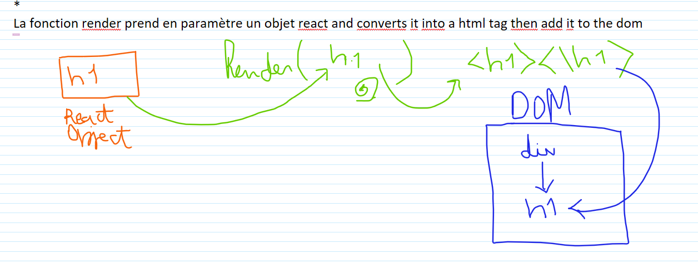
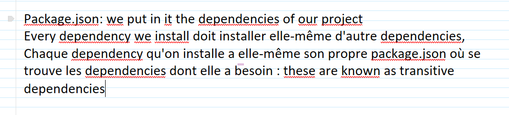
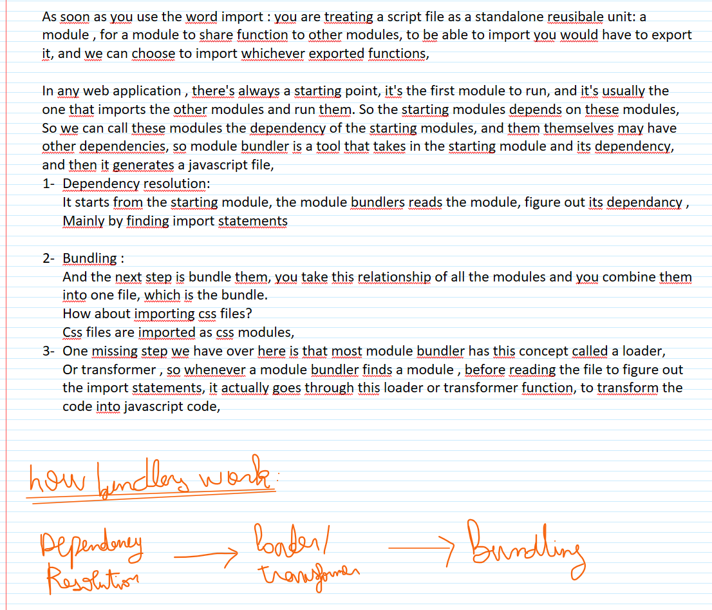
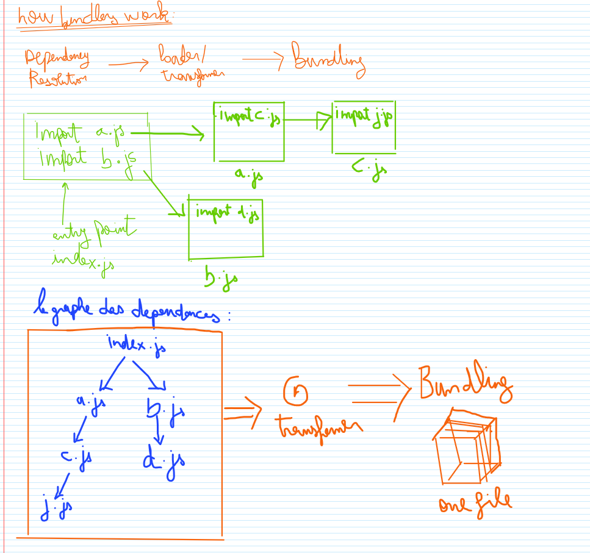
#Parcel 
_Dev build
_Local Server
_HMR : Hot Module Replacement using File Watching Algorithm - (written in C++)
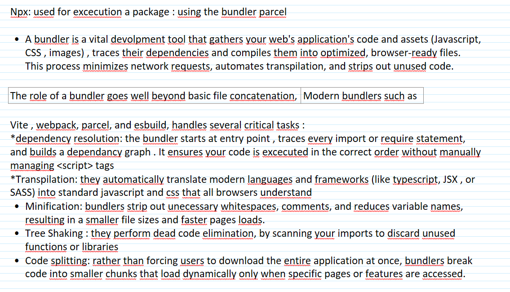
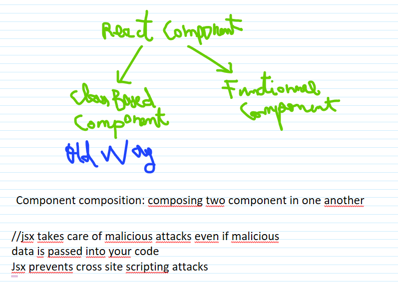
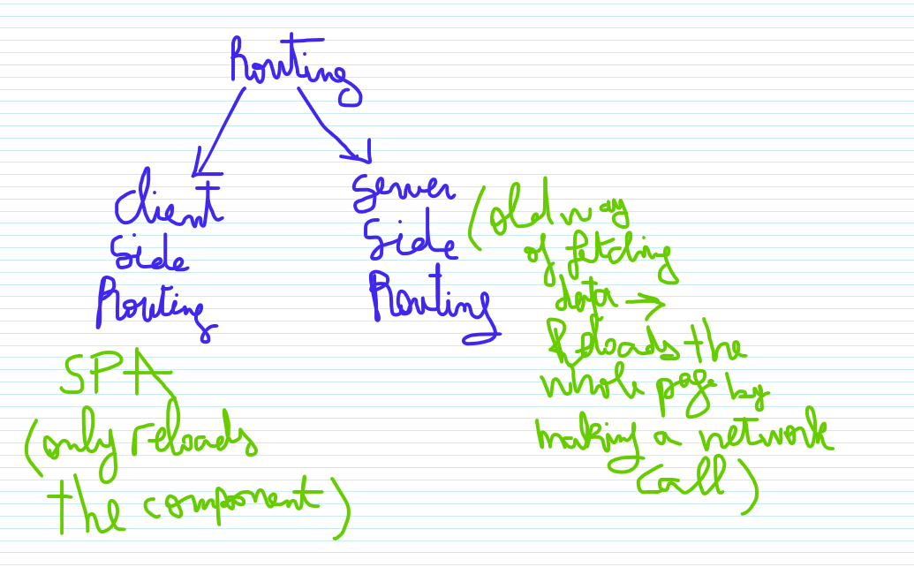
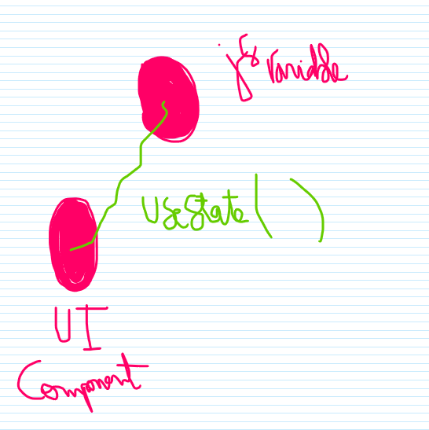
useState est le mécanisme qui permet à React de synchroniser les données (state) avec l'interface utilisateur (UI).
-the main purpose of using graphQL is to load only data required in your app
// 
behind the scenes , the Link component of react is using <href a tag>

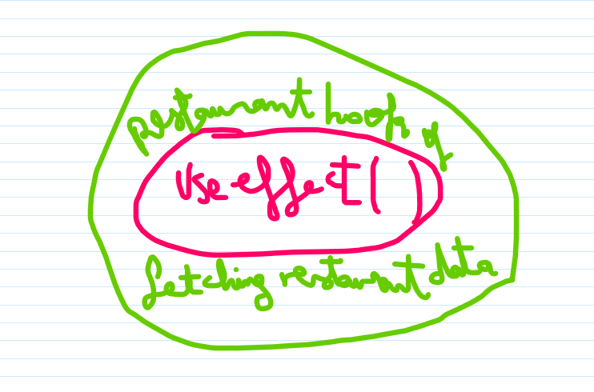

+useParams est utilisé pour extraire des données de l'url
